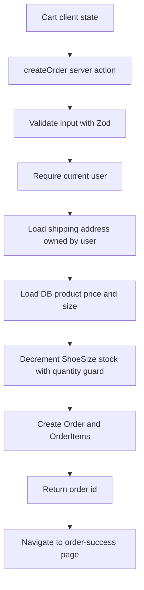
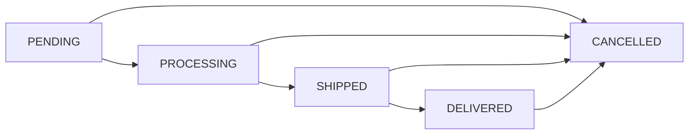

# สถาปัตยกรรมระบบ KicksVault

KicksVault เป็น storefront แบบ full-stack บน Next.js App Router โดยแยก public storefront, authenticated shop area และ admin area ออกจากกันตาม route group

## 1. Route map

```text
/
/product
/product/[slug]
/login
/register
/cart
/account
/account/addresses
/account/favorites
/account/orders
/account/orders/[id]
/order-success/[id]
/admin
/admin/orders
/admin/orders/[id]
/admin/shoes
/admin/shoes/new
/admin/shoes/[id]
```

API routes:

```text
/api/auth/login
/api/auth/logout
/api/auth/me
/api/auth/refresh
/api/auth/register
/api/brands
/api/shoes
/api/shoes/[id]
/api/admin/shoes
/api/admin/shoes/[id]
/api/admin/uploads/shoes
```

## 2. Request protection

`proxy.ts` ป้องกัน route หลัก:

```text
/account
/cart
/admin
```

ถ้าไม่มี access token หรือ refresh token จะ redirect ไป `/login`

Admin ใช้ guard ซ้ำฝั่ง server ใน `app/admin/layout.tsx` ผ่าน `requireAdmin()`

## 3. Auth model

Auth ใช้ custom JWT cookies:

- `accessToken` อายุสั้น
- `refreshToken` อายุยาวกว่า
- password hash ด้วย bcrypt
- refresh token เก็บใน database เป็น hash

ไฟล์สำคัญ:

```text
lib/auth.ts
lib/jwt.ts
app/api/auth/login/route.ts
app/api/auth/refresh/route.ts
app/api/auth/logout/route.ts
```

## 4. Data model

ตารางหลัก:

- `User`
- `UserAddress`
- `Brand`
- `Shoe`
- `ShoeImage`
- `ShoeSpec`
- `ShoeSize`
- `Favorite`
- `Order`
- `OrderItem`

ความสัมพันธ์สำคัญ:

- User มีหลาย Order
- User มีหลาย UserAddress
- Shoe มีหลาย ShoeSize
- Shoe มีหลาย ShoeImage และ ShoeSpec
- Order มีหลาย OrderItem
- Favorite เป็นความสัมพันธ์ User + Shoe พร้อม unique constraint

## 5. Checkout flow



หลักสำคัญ:

- ไม่เชื่อราคาจาก client
- stock decrement และ order creation อยู่ใน Prisma transaction เดียวกัน
- `OrderItem.price` เป็น snapshot ราคาตอนซื้อ
- `Order` เก็บ snapshot ที่อยู่จัดส่ง

## 6. Order status flow



หมายเหตุ:

- User ยกเลิกเองได้เฉพาะ `PENDING` ภายใน 30 นาที
- Admin สามารถยกเลิกตาม workflow fulfillment
- เมื่อยกเลิก ระบบคืน stock ผ่าน `lib/order-cancellation.ts`
- การคืน stock guard ด้วย `stockRestoredAt`

## 7. Payment model

Payment ตอนนี้เป็น mock:

- `MANUAL`
- `BANK_TRANSFER`
- `COD`

Payment status:

- `UNPAID`
- `PAID`
- `FAILED`
- `REFUNDED`

เมื่อยกเลิกออเดอร์ที่ `PAID` ระบบเปลี่ยนเป็น `REFUNDED`

## 8. Product discovery

หน้าร้านใช้ helper:

```text
lib/product-discovery.ts
```

รองรับ:

- audience: all, men, women, kids
- price ranges
- availability
- collections
- search
- recommendations

## 9. Admin architecture

Admin area แยกเป็น:

- `app/admin/page.tsx` dashboard
- `app/admin/dashboard-data.ts` query และ aggregate data
- `app/admin/orders/*` จัดการ payment และ fulfillment
- `app/admin/shoes/*` จัดการสินค้า
- `app/api/admin/uploads/shoes/route.ts` local upload

## 10. UI state

- Cart ใช้ Zustand ใน `app/store/cart-store.ts`
- Auth provider อยู่ใน `app/component/auth/AuthProvider.tsx`
- Shared button/hover style อยู่ใน `lib/ui-interactions.ts`
- Skeleton loading อยู่ใน `app/component/ui/Skeleton.tsx` และ route loading files
